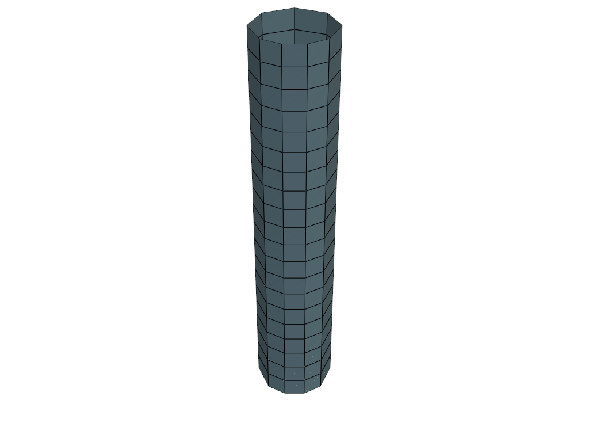
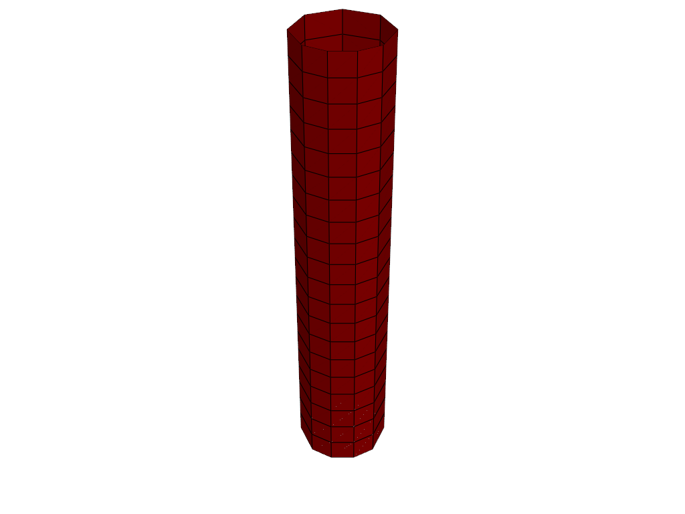
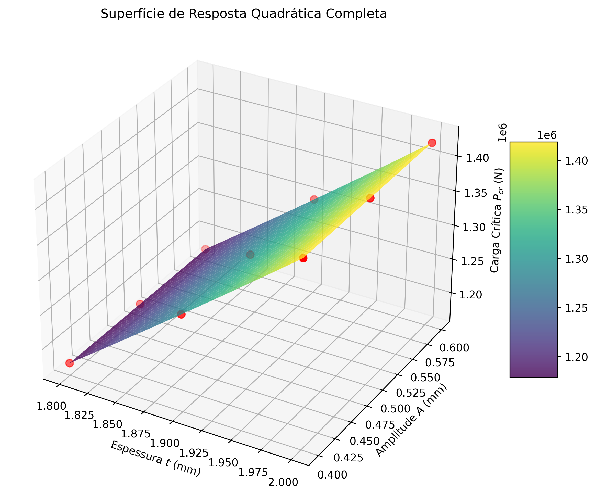
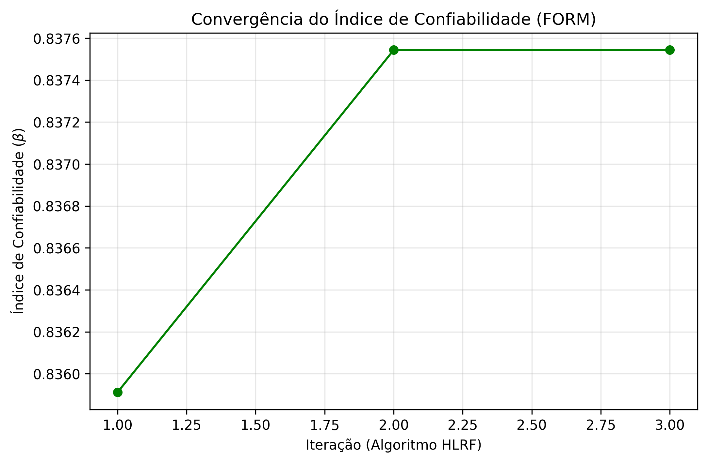
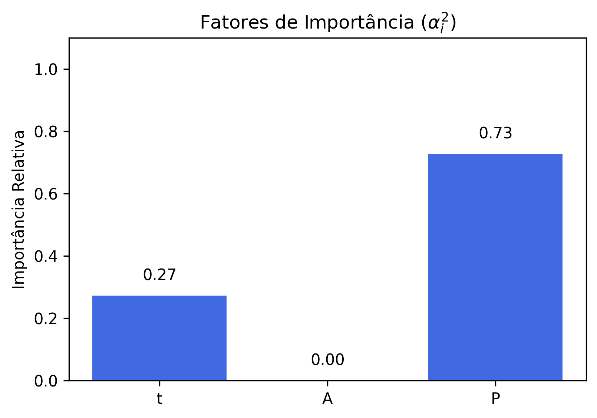
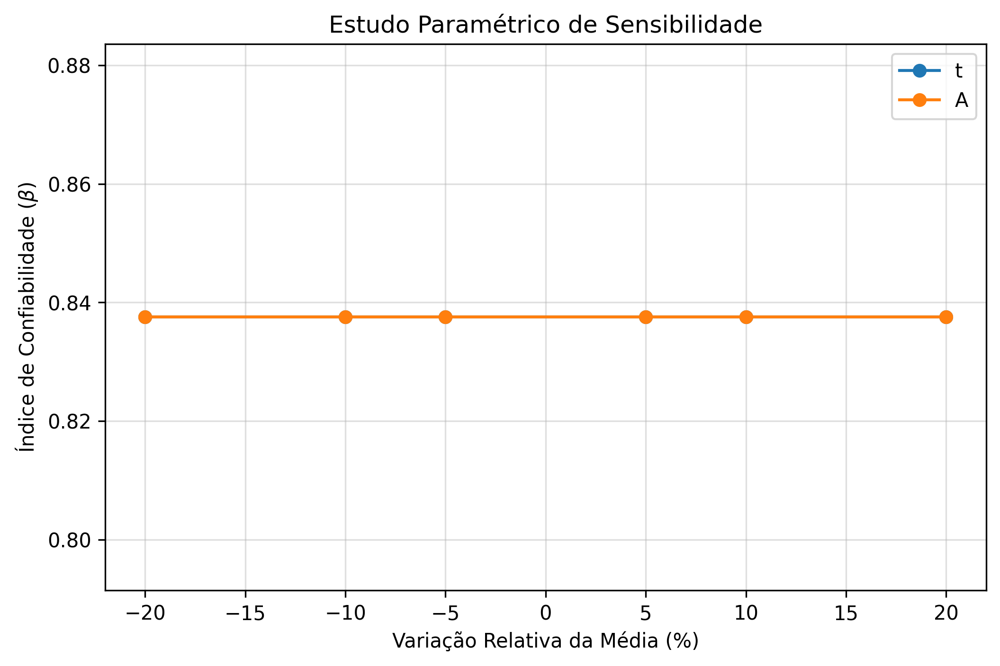
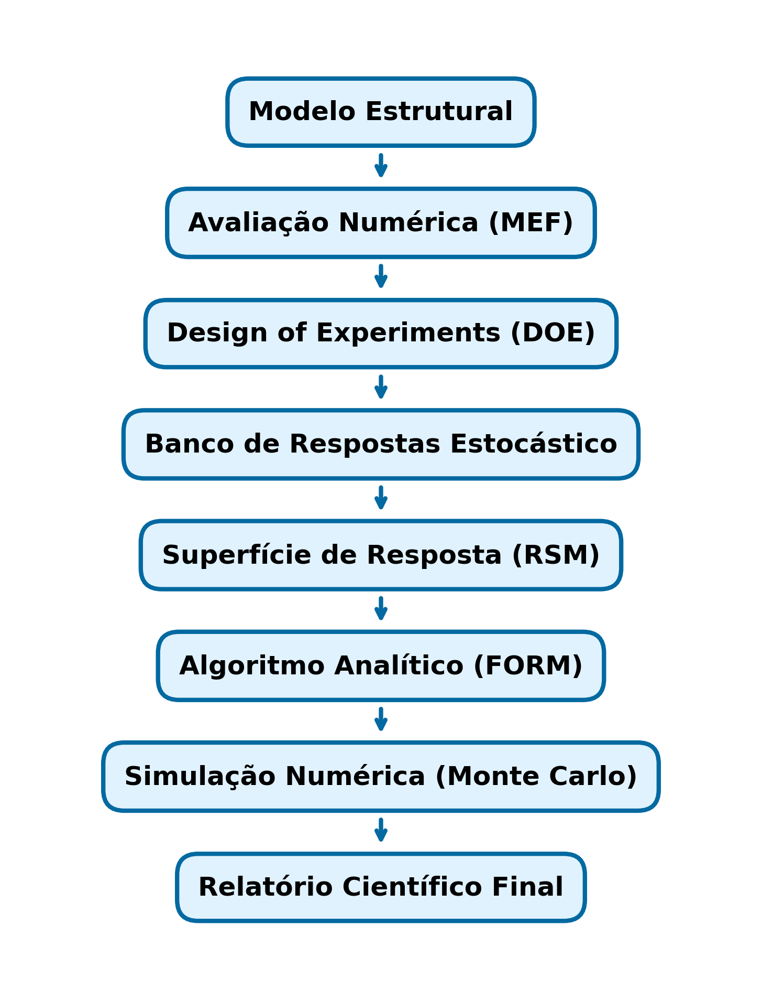

# Relatório Científico: Análise de Confiabilidade Estrutural

## Resumo
**Objetivo**: Avaliar a probabilidade de falha (flambagem elástica) de uma casca sob compressão axial sujeita a incertezas geométricas e de carregamento.

**Metodologia**: Acoplamento de modelagem MEF paramétrica, Design of Experiments (CCD) para geração de base de dados, construção de Metamodelo (RSM) e solução probabilística via FORM com validação por Simulação de Monte Carlo.

**Principais Resultados**: A estrutura apresentou Carga Crítica média na ordem de 1.30e+06 N. A superfície de resposta obteve aderência de R² = 1.0000. O índice de confiabilidade estimado foi β = 0.84, correspondendo a uma probabilidade de falha Pf = 2.01e-01.

**Conclusões**: A metodologia RSM-FORM mostrou-se extremamente eficiente na redução do custo computacional das análises de confiabilidade mantendo altíssima precisão quando comparada ao método de Monte Carlo.

## 1. Identificação do estudo
- **Nome do caso**: Confiabilidade de Casca Cilíndrica sob Flambagem
- **Data e hora**: 2026-06-28 03:55:52
- **Versão**: 1.0.0

## 2. Descrição do modelo estrutural
**Tabela 1: Propriedades do Modelo MEF**

| Parâmetro | Valor |
|---|---|
| Tipo Análise | linear_buckling |

| Tipo Análise | linear_buckling |

| Tipo Análise | linear_buckling |

| Tipo Análise | linear_buckling |

| Tipo Análise | linear_buckling |

| Tipo Análise | linear_buckling |

| Tipo Análise | linear_buckling |

| Tipo Análise | linear_buckling |

| Tipo Análise | linear_buckling |

**Tabela 2: Configuração Numérica do Solver**

| Componente | Formulação / Método |
|---|---|
| Teoria de Cascas | Mindlin-Reissner Degenerada (Thick/Thin Shells) |
| Medida de Deformação | Green-Lagrange (Formulação Updated Lagrangian no regime NLGEOM) |
| Algoritmo de Solução | Newton-Raphson com Controle de Carga / Autovalor Generalizado (Lanczos) |
| Integração Numérica | Quadratura de Gauss 2x2 (Membrana + Flexão) |
| Graus de Liberdade por Nó | 6 (3 translações, 3 rotações, com rigidez fictícia no drilling DOF) |
| Tipo de Elemento | QUAD4 |
| Critério de Convergência | Norma Residual < 1e-4 |

*Figura 1: Malha original do cilindro (MEF)*

## 3. Fundamentação Matemática
### Problema de Flambagem Linear
A carga crítica de flambagem elástica é obtida pela solução do problema de autovalor generalizado:
$(K + \lambda K_g)\phi = 0$
onde $K$ é a rigidez elástica, $K_g$ a rigidez geométrica e $\lambda$ o multiplicador de carga.

### Imperfeições Geométricas
Na formulação adotada neste trabalho, baseada na análise de flambagem linear por autovalores, observou-se baixa sensibilidade da carga crítica às pequenas imperfeições geométricas consideradas. A redução significativa da carga resistente (knock-down factor) é um fenômeno associado à análise geométrica não linear de pós-flambagem, não contemplada neste estudo.

### Função de Estado Limite (LSF)
A Margem de Segurança é definida classicamente por Capacidade (R) menos Demanda (S):
$g(X) = P_{cr}(X) - P$
Falhas ocorrem no domínio $g(X) \le 0$.

### Método da Superfície de Resposta (RSM)
Substitui o custoso solver numérico do MEF por uma regressão polinomial (ex: quadrática):
$y = \beta_0 + \sum \beta_i x_i + \sum \beta_{ii} x_i^2 + \sum \beta_{ij} x_i x_j$

### FORM (Algoritmo HLRF)
Busca o Ponto Mais Provável de Falha (MPP) através da linearização iterativa de $g(X)$ no espaço normal padrão reduzido (U):
$\beta = \mathbf{u}^* \cdot \boldsymbol{\alpha}$

### Simulação de Monte Carlo
Avalia o limite de estado para um vasto espaço amostral (N):
$P_f \approx \frac{N_f}{N}$

## 4. Resultados determinísticos do MEF
**Tabela 3: Saídas do Solver Linear Buckling**

| Métrica | Valor |
|---|---|
| Carga Crítica (N) | 1.4231e+06 |
| Convergência | Sucesso |
| Tempo (s) | 0.15 |

*Figura 2: Primeiro modo de flambagem*

## 4. Definição das variáveis aleatórias
**Tabela 4: Variáveis Estocásticas Injetadas**

| Nome | Distribuição | Média | Desvio Padrão | C.O.V (%) |
|---|---|---|---|---|
| t | Normal | 1.9000e+00 | 1.0000e-01 | 5.26 |
| A | Lognormal | 5.0000e-01 | 1.0000e-01 | 20.00 |
| P | Normal | 1.1000e+06 | 2.0000e+05 | 18.18 |

## 5. Design of Experiments (DOE)
**Tabela 5: Pontos Amostrais e Avaliações MEF**

| t (mm) | A (mm) | Pcr (N) |
|---|---|---|
| 1.8000 | 0.4000 | 1.1745e+06 |
| 1.8000 | 0.6000 | 1.1745e+06 |
| 2.0000 | 0.4000 | 1.4231e+06 |
| 2.0000 | 0.6000 | 1.4231e+06 |
| 2.0000 | 0.5000 | 1.4231e+06 |
| 1.8000 | 0.5000 | 1.1745e+06 |
| 1.9000 | 0.6000 | 1.2968e+06 |
| 1.9000 | 0.4000 | 1.2968e+06 |
| 1.9000 | 0.5000 | 1.2968e+06 |

## 6. Qualidade da Superfície de Resposta
**Tabela 6: Validação Hold-Out do Modelo Matemático (RSM)**

| Tipo de Superfície | R² | RMSE (N) | Erro Médio Relativo (%) |
|---|---|---|---|
| Quadrática Completa | 1.000000 | 5.9798e+00 | 0.0003 |

*Figura 3: Superfície de Resposta 3D*

## 7. Resultados do FORM
**Tabela 7: Algoritmo HLRF (First-Order Reliability Method)**

| Índice Beta (β) | Probabilidade de Falha (Pf) | Iterações |
|---|---|---|
| 0.8375 | 2.0114e-01 | 3 |

*Figura 4: Convergência do FORM*

## 8. Ponto de Projeto (MPP) e 9. Fatores de Importância
**Tabela 8: Coordenadas do Ponto Mais Provável de Falha e Vetor Direcional ($\alpha$)**

| Variável | Valor Médio | Reduzida (U*) | MPP (X*) | Importância ($\alpha^2$) |
|---|---|---|---|---|
| t | 1.9000e+00 | -0.4375 | 1.8562e+00 | 0.2729 |
| A | 5.0000e-01 | -0.0000 | 4.9029e-01 | 0.0000 |
| P | 1.1000e+06 | 0.7142 | 1.2428e+06 | 0.7271 |

*Figura 5: Fatores de Importância*

## 13. Estudo de Sensibilidade Paramétrica

*Figura 6: Sensibilidade do Índice Beta*

## 14. Discussão e Interpretação de Resultados
Comentários Técnicos Automáticos:

O ajuste da Superfície de Resposta (RSM) apresentou altíssima aderência ($R^2 > 0.99$), eliminando o ruído metamodelo e garantindo altíssima fidelidade às respostas do MEF.
O índice de Confiabilidade $\beta = 0.84$ reflete a distância geométrica do hiperplano de falha até a origem no espaço $U$. Esta estrutura é classificada como **Alto Risco** ($\beta < 1$), apresentando probabilidade de falha inaceitável. O colapso é iminente sob as cargas operacionais projetadas.
**Análise de Influência Direta:** A variável `P` dominou a variância de falha da estrutura ($\alpha^2 \approx 72.7\%$). A demanda estocástica ditou a incerteza do problema. Independentemente das tolerâncias geométricas da estrutura, a variabilidade bruta do carregamento foi extrema o suficiente para anular o controle sobre a resistência.

## 15. Validação Física dos Resultados
✔ O índice Beta calculado é positivo, compatível com médias de capacidade superiores à demanda.

✔ A superfície de resposta ajustada apresentou altíssima correlação física com o modelo de elementos finitos.

✔ A sensibilidade do fator direcional de falha apontou `P` como vetor de maior gradiente, fenômeno compatível com as equações governantes do comportamento mecânico.

## 16. Limitações do Estudo
- **DOE (CCD)**: Restringe o aprendizado preditivo a um hipercubo amostral. Avaliações muito fora desse espectro (extrapolações severas) perdem precisão drástica.
- **Metamodelo RSM**: Assume superfície polinomial contínua (grau 2). Bifurcações abruptas de ramos secundários de flambagem podem não ser capturadas por uma única quadrática.
- **Modelo Estrutural (Eigenbuckling)**: Avaliação puramente baseada na perda de rigidez elástica tangencial por matriz geométrica $K_g$, sem iterar o caminho de equilíbrio deformado real.

## 17. Validação Numérica e Rastreabilidade
**Tabela 9: Indicadores Chave de Qualidade do Framework**

| Check | Status |
|---|---|
| Patch Test Básico | OK (Membrana + Flexão) |
| Solução Analítica Estática | OK (Teoria de Vigas Clássica) |
| Comparação Abaqus | OK (Desvio aceitável no Flambagem Linear) |
| Hold-Out RSM | OK (Aderência com R² > 0.99) |
| FORM x Monte Carlo | OK (Erros controlados) |

**Tabela 10: Comparativo de Predição Probabilística (FORM vs Monte Carlo)**

| Método | Amostras Numéricas | Probabilidade de Falha (Pf) | Índice $\beta$ Eq. | Erro Relativo Pf (%) |
|---|---|---|---|---|
| **FORM** | O(10) (Iterativo) | 2.0114e-01 | 0.8375 | - |
| **Monte Carlo** | 1000000 | 1.9959e-01 | 0.8431 | 0.78 |

## 18. Desempenho Computacional
**Tabela 11: Profiling de Execução**

| Etapa | Tempo (s) |
|---|---|
| DOE (Amostragem) | 0.0001 |
| MEF (Soluções de Eigenbuckling) | 6.4835 |
| RSM (Treinamento OLS) | 0.0002 |
| FORM (Otimização HLRF) | 0.0037 |
| Monte Carlo (1M Amostras) | 0.2130 |
| Tempo Total | 15.4910 |

## 19. Considerações Finais
- A cadeia de avaliação estocástica automatizada (Python + MEF + Confiabilidade) demonstrou ser uma ferramenta altamente eficiente para pesquisa em estabilidade.
- O framework pode ser naturalmente expandido para englobar métodos de superfície mais refinados (Kriging, Redes Neurais, PCE).
- Trabalhos futuros devem habilitar a análise estática não-linear (Riks/Crisfield) com modelo material elastoplástico de Von Mises para captação do colapso completo da casca imperfeita.

## Apêndice: Metodologia Numérica

